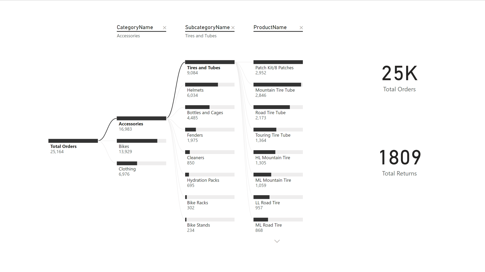

# AdventureWorks Power BI Project

## Overview
This repository contains a comprehensive Power BI project based on the AdventureWorks database. The project includes various reports and dashboards designed to provide insights into sales performance, customer demographics, and product analysis. The goal of this project is to demonstrate the power of data visualization in making informed business decisions.

The AdventureWorks database is a fictitious company that manufactures and sells bicycles and cycling accessories. The dataset encompasses various aspects of the business, including sales orders, customer information, product details, and more. By analyzing this data, we can uncover trends, identify key performance indicators (KPIs), and gain valuable insights into business operations.

### Key Features:
- **Interactive Dashboards**: Highly interactive and dynamic dashboards that allow users to filter data and drill down into specifics.
- **Visualizations**: A variety of visualizations including bar charts, line graphs, pie charts, and maps to represent data effectively.
- **Data Models**: Robust data models that ensure data integrity and provide a solid foundation for analysis.
- **User-Friendly Design**: Dashboards designed with the end-user in mind, ensuring ease of use and intuitive navigation.

### Objectives:
- **Sales Analysis**: Track and analyze sales performance over time, across different regions and product categories.
- **Customer Insights**: Understand customer demographics, purchasing patterns, and customer segments to tailor marketing strategies.
- **Product Performance**: Evaluate the performance of various products, identify bestsellers, and manage inventory effectively.
- **Business Growth**: Identify growth opportunities and make data-driven decisions to enhance business operations.

By leveraging the capabilities of Power BI, this project showcases how data can be transformed into actionable insights, driving strategic decisions and improving overall business performance.

## Project Structure
- `data/`: Contains raw data files used in the project (e.g., CSV, Excel).
- `reports/`: Contains Power BI Desktop files (`.pbix`) with the designed reports and dashboards.
- `docs/`: Contains additional documentation for the project.
- `images/`: Contains screenshots of the reports and dashboards.

<h2 style="color:blue;">Screenshots</h2>

<h3 style="color:green;">Executive Dashboard</h3>

This executive dashboard provides high-level KPIs, including total revenue, profit, orders, and return rate.

<h3 style="color:green;">Map Visualization</h3>

This map visual shows the geographic distribution of sales across different regions.

<h3 style="color:green;">Product Performance Chart</h3>

This chart visualizes the performance of different products, highlighting bestsellers and underperforming items to help manage inventory and marketing strategies.

<h3 style="color:green;">Customer Demographics Dashboard</h3>

This dashboard offers insights into customer demographics, showing age distribution, gender breakdown, and geographic locations of customers.

<h3 style="color:green;">Q&A</h3>

This visual allows users to ask natural language questions about the data and receive answers in the form of charts, graphs, or tables. It provides a dynamic way to interact with the dataset, helping users to explore and gain insights without needing to create complex queries.

<h3 style="color:green;">Decomposition Tree</h3>

This visualization shows a decomposition tree that breaks down total orders by category, subcategory, and product.

<h3 style="color:green;">Key Influencers</h3>

This report uses the key influencers visual to show factors that influence specific outcomes, such as customer likelihood to buy.

<h3 style="color:green;">Data Model</h3>

This image shows the data model used in the Power BI project, illustrating the relationships between different tables and the structure of the data.

